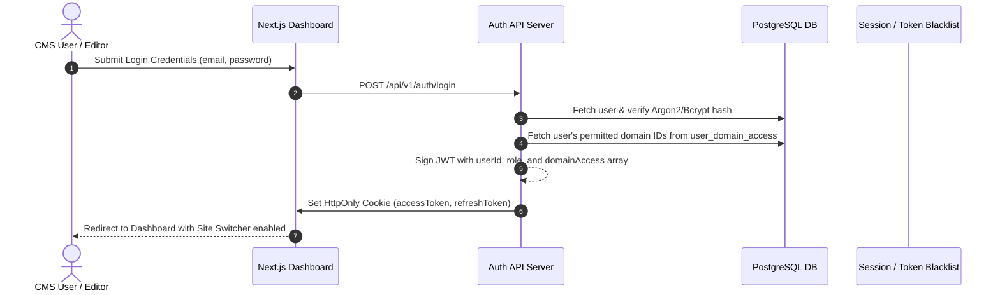
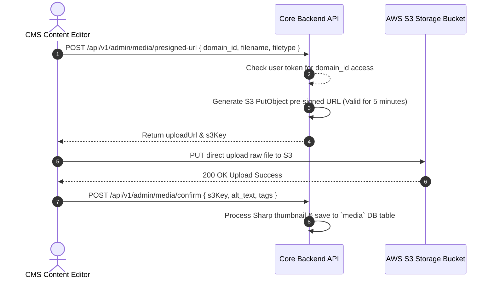

# Multi-Tenant Authentication & Authorization (RBAC) Architecture

This document details the **Authentication, Authorization, and Security Strategy** for the CMS Platform, meeting the SOW requirements for secure admin access, role-based multi-domain isolation, and secure asset management.

---

## 1. Authentication Overview

The system uses a stateless **JWT (JSON Web Token)** stored in encrypted **`HttpOnly`, `SameSite=Strict`, `Secure` cookies** to manage user sessions across the unified CMS dashboard.



---

## 2. Role-Based Access Control (RBAC) Matrix

Users are assigned a global role and a list of permitted domain tenants in `user_domain_access`.

| Role | Permissions & Capabilities | Domain Scope |
| :--- | :--- | :--- |
| **SUPER_ADMIN** | Full system control. Can add/delete domain tenants, manage global users, configure platform settings, publish any page. | **All Domains (`*`)** |
| **DOMAIN_ADMIN** | Full administrative access for assigned domains. Can create/publish pages, manage media library, configure SEO metadata, and build forms. | **Assigned Domains Only** |
| **CONTENT_EDITOR** | Can create and edit page blocks and save drafts. Cannot publish pages live or delete domains without approval. | **Assigned Domains Only** |
| **SEO_SPECIALIST** | Access restricted to page SEO metadata, canonical tags, `sitemap.xml` overrides, 301 redirects, and robots.txt rules. | **Assigned Domains Only** |

---

## 3. Multi-Tenant Authorization Guard Middleware

Every admin API endpoint (`/api/v1/admin/*`) executes a **Domain Isolation Guard** to ensure that a user assigned to Domain A (`domain_a.com`) cannot view, edit, or delete resources belonging to Domain B (`domain_b.com`).

### Middleware Flow Code Example (TypeScript / Express)

```typescript
import { Request, Response, NextFunction } from 'express';
import jwt from 'jsonwebtoken';

interface AuthTokenPayload {
  userId: string;
  role: 'SUPER_ADMIN' | 'DOMAIN_ADMIN' | 'CONTENT_EDITOR' | 'SEO_SPECIALIST';
  domainAccess: string[]; // e.g., ['shivit_com', 'brand_b_com']
}

export function authorizeTenantAccess(requiredRole?: string) {
  return (req: Request, res: Response, next: NextFunction) => {
    try {
      const token = req.cookies.access_token;
      if (!token) {
        return res.status(401).json({ error: 'Unauthorized: Missing authentication token' });
      }

      // 1. Verify JWT
      const decoded = jwt.verify(token, process.env.JWT_SECRET!) as AuthTokenPayload;
      req.user = decoded;

      // 2. Super Admins bypass tenant restriction check
      if (decoded.role === 'SUPER_ADMIN') {
        return next();
      }

      // 3. Extract target domain from header or request parameter
      const targetDomainId = (req.headers['x-tenant-id'] || req.query.domain_id || req.body.domain_id) as string;

      if (!targetDomainId) {
        return res.status(400).json({ error: 'Bad Request: Target tenant domain_id required' });
      }

      // 4. Verify user has explicit access to target domain
      const hasDomainAccess = decoded.domainAccess.includes(targetDomainId);
      if (!hasDomainAccess) {
        return res.status(403).json({ 
          error: `Forbidden: You do not have permission to access tenant ${targetDomainId}` 
        });
      }

      next();
    } catch (err) {
      return res.status(401).json({ error: 'Unauthorized: Invalid or expired token' });
    }
  };
}
```

---

## 4. Secure File Upload Architecture (S3 Pre-Signed URLs)

Direct file uploads through backend servers consume high CPU/RAM. The platform uses **S3 Pre-signed URLs** with mandatory role & domain authorization:



---

## 5. Security & Anti-Spam Protections

1. **Lead Form Submissions (Public):**
   - **Captcha Protection:** Integrated **Cloudflare Turnstile** or **reCAPTCHA v3** to prevent automated bot form spam.
   - **Rate Limiting:** IP-based token-bucket rate limiter via **Redis** (`max 5 form submissions per IP per 10 minutes`).
   - **XSS & Input Sanitization:** All text inputs are sanitized using DOMPurify and validated against strict Zod schemas before database insertion.

2. **Session Security & Hardening:**
   - **Token Expiry:** Access Token expires in 15 minutes; Refresh Token stored in HttpOnly cookie expires in 7 days.
   - **Password Hashing:** Passwords hashed using **Argon2id** with salt.
   - **CORS Protection:** Restricted CORS policy allowing only authorized CMS dashboard domain origins to interact with admin API routes.
