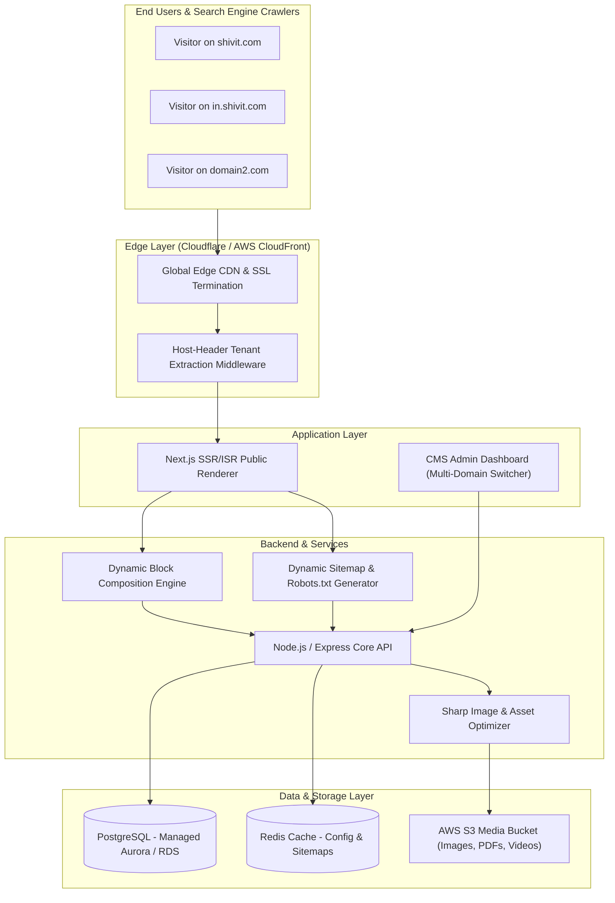

# High-Level Architecture Design

This document details the high-level system architecture for the **Multi-Domain, SEO-First, CMS-Driven ERP Website Platform** (`shivit.com` and associated sub-domains/tenants).

---

## 1. Executive System Overview

The application is built on a **Headless, Multi-Tenant Architecture** where a single unified admin dashboard and core API power multiple public-facing domain tenants (`shivit.com`, `in.shivit.com`, `domain2.com`).

---

## 2. Core Architectural Pillars

### Pillar 1: Host-Header Tenant Resolution
* **Zero Folder Duplication:** No separate subfolders or hardcoded domain conditionals.
* **Single Deployment:** The application runs as a single cluster. The edge middleware extracts the incoming `Host` header (e.g. `shivit.com` or `domain2.com`), queries the tenant cache, and injects a `x-tenant-id` context into downstream requests.

### Pillar 2: Dynamic JSON Block System
* Pages are not hardcoded templates. Every page is rendered dynamically from an ordered array of configurable **Content Block JSON primitives** (Hero Slider, Feature Grid, Video Embed, FAQ Accordion, CTAs).
* Non-technical users can construct unlimited custom landing pages directly from the CMS.

### Pillar 3: SEO-First Static & Dynamic Rendering
* **Hybrid ISR/SSR:** Public pages utilize Incremental Static Regeneration (ISR) to serve edge-cached static HTML with near-instant TTFB (Time to First Byte).
* **Per-Tenant SEO Isolation:** Independent sitemaps (`/sitemap.xml`), configurable `robots.txt`, schema JSON-LD, OpenGraph tags, and regional canonical URLs (`/erp-software` vs `/in/erp-software`) generated on-the-fly per request host.

### Pillar 4: Centralized Media & Asset Pipeline
* All images, brochures (PDF, DOC), and walkthrough videos are stored in a central Media Library on **AWS S3**.
* Image URLs pass through **Sharp / Next.js Image Optimization** to deliver WebP/AVIF formats with dynamic responsive srcsets and mandatory accessibility alt-tags.

---

## 3. High-Level Data Flow Sequence

1. **User Requests URL:** Client requests `https://shivit.com/erp-software`.
2. **Edge Processing:** Cloudflare/CloudFront terminates SSL, preserves `Host: shivit.com`, and passes the request to the Next.js renderer.
3. **Middleware Resolution:** Next.js Edge Middleware checks host `shivit.com` -> resolves to `tenant_id: "shivit_main"`.
4. **Cache & Render Check:** 
   - If static page exists in ISR cache, served instantly.
   - If cache expired or miss, fetches block array for `slug: "erp-software"` and `domain_id: "shivit_main"` from backend API.
5. **Dynamic Assembly:** Next.js renders the block JSON using matching React block components and injects tenant-specific SEO metadata.
6. **HTML Response:** Fully hydrated, SEO-optimized HTML returned to client and cached at CDN edge.
