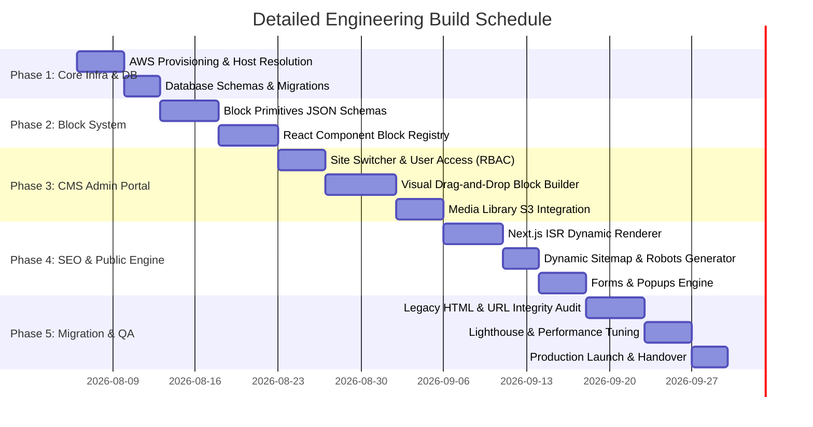

# Comprehensive Implementation & Build Plan

This document outlines the step-by-step engineering plan to build, test, migrate, and launch the **Multi-Tenant SEO-First CMS Platform**.

---

## 1. Project Phase Roadmap

---

## 2. Phase-by-Phase Deliverables

### Phase 1: Infrastructure & Tenant Resolution Setup
* Provision AWS S3 bucket and CloudFront CDN for media delivery.
* Configure managed PostgreSQL instance (AWS RDS / Aurora) with Prisma/Drizzle.
* Implement Next.js Edge Middleware for Host header extraction (`x-tenant-host`).

### Phase 2: Dynamic Block System Development
* Define Zod validation schemas for all 20+ mandatory content blocks (Hero, Features Grid, Accordion FAQ, Stats, Video Embeds, Brochure Download, Forms).
* Build modern UI React component implementations using Vanilla CSS / Tailored CSS tokens matching ERP-grade aesthetics.

### Phase 3: CMS Admin Panel Development
* Build centralized admin interface featuring:
  - Top-bar **Site Switcher** dropdown to toggle context between tenants.
  - **Drag-and-Drop Page Builder** allowing content managers to construct pages visually.
  - **Central Media Library** supporting WebP image optimization and PDF brochure uploads.
  - Role-based permissions matrix (Super Admin, Domain Admin, Content Editor).

### Phase 4: Public Frontend Engine & SEO Architecture
* Set up Next.js App Router dynamic page rendering (`[...slug]`) with Incremental Static Regeneration (ISR).
* Build automatic SEO Engine:
  - Host-aware `sitemap.xml` and `robots.txt`.
  - Regional path meta handling (`/erp-software` vs `/in/erp-software`).
  - OpenGraph, Meta Title, Description, and JSON-LD schema injection.
* Build Form and Popup engine supporting scroll-based, exit-intent, and time-delayed lead forms.

### Phase 5: Legacy Content Migration & URL Audit
* Audit 100% of existing `shivit.com` URLs to ensure zero structural changes.
* Migrate existing static HTML content into structured block data.
* Configure 301 redirect map in CMS to preserve search engine indexing.

### Phase 6: QA, Performance Optimization & Handover
* Run Core Web Vitals audit (achieve 90+ Mobile & Desktop scores).
* Execute cross-browser and mobile responsiveness testing.
* Hand over complete source code repository, CMS credentials, and technical operational documentation.

---

## 3. Verification & Definition of Done (DoD)

To consider the project accepted and complete according to the SOW:

- [ ] **Multi-Domain Tenant Resolution:** Adding a new domain record in the CMS renders unique pages, sitemaps, and metadata under that host without redeploying code.
- [ ] **Zero Code Page Creation:** Non-technical staff can build, publish, or edit pages using blocks without developer intervention.
- [ ] **SEO & URL Integrity:** All legacy URLs return HTTP 200 OK or appropriate approved 301 redirects with accurate SEO tags.
- [ ] **Performance Benchmarks:** Core Web Vitals (LCP < 2.5s, CLS < 0.1, FID/INP < 200ms) verified on mobile and desktop.
- [ ] **Full Source Code Ownership:** Handover of Git repository, database scripts, and administrative documentation.
