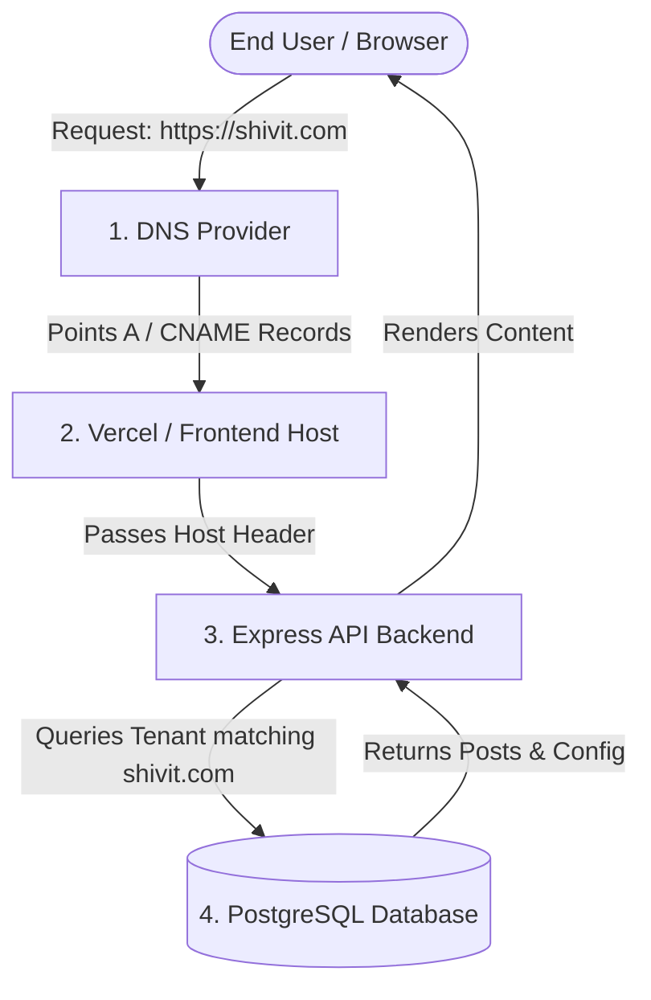

# Real Domain Integration & Setup Requirements
## Shivit Multi-Domain CMS Production Transition Guide

This document defines all technical requirements, DNS configurations, database updates, hosting settings, and security measures needed to replace mock/example domains with real live production domains (e.g., `shivit.com`, `shivit.in`).

---

## 📐 Architecture Overview



---

## 1. 🌐 DNS Requirements (Domain Registrar / DNS Provider)

For every real domain that needs to be attached to the CMS, configure the following DNS records at your registrar (e.g., Cloudflare, GoDaddy, Namecheap, AWS Route53):

### A. Primary Domain (`shivit.com`)
| Record Type | Host / Name | Target / Value | Purpose |
| :--- | :--- | :--- | :--- |
| **A Record** | `@` (Root) | `76.76.21.21` *(Vercel IP)* | Directs root traffic to hosting server |
| **CNAME Record** | `www` | `cname.vercel-dns.com` | Directs `www` traffic to hosting server |
| **TXT Record** | `_acme-challenge` | *(Provided by host)* | SSL Certificate validation |

### B. Secondary / Regional Domains (e.g., `shivit.in`, `shivit.eu`)
| Record Type | Host / Name | Target / Value | Purpose |
| :--- | :--- | :--- | :--- |
| **A Record** | `@` (Root) | `76.76.21.21` | Points regional root domain to server |
| **CNAME Record** | `www` | `cname.vercel-dns.com` | Points regional `www` domain to server |

---

## 2. 🚀 Hosting & SSL Requirements (Vercel / Frontend Server)

1. **Domain Registration in Vercel:**
   - Navigate to **Project Settings** → **Domains**.
   - Add both naked (`shivit.com`) and `www` (`www.shivit.com`) domains.
   - Configure automatic redirect from `www` to root (or vice versa).

2. **Automatic SSL / TLS Provisioning:**
   - HTTPS certificates will auto-generate via Let's Encrypt once DNS records propagate.
   - Ensure HSTS (HTTP Strict Transport Security) is enabled.

---

## 3. 🗄️ Database Record Migration (PostgreSQL / Neon)

Update the `domains` and `regions` tables to match real production domains.

```sql
-- Step 1: Update primary domain entry
UPDATE domains 
SET 
  name = 'Shivit Global', 
  url = 'https://shivit.com' 
WHERE id = 1;

-- Step 2: Update secondary domain entry
UPDATE domains 
SET 
  name = 'Shivit India', 
  url = 'https://shivit.in' 
WHERE id = 2;

-- Step 3: Verify regions linked to domain IDs
SELECT d.id, d.name, d.url, r.name AS region_name, r.slug 
FROM domains d
LEFT JOIN regions r ON r.domain_id = d.id;
```

---

## 4. 🔒 CORS & Security Requirements (Backend API)

The backend Express application (`backend/src/app.ts`) must allow CORS requests from the newly added production domains.

### Environment Variable Update (Render Backend)
```env
CORS_ORIGIN=https://shivit.com,https://www.shivit.com,https://shivit.in,https://www.shivit.in,https://content-stack-mu.vercel.app
```

---

## 5. ⚙️ Request Host Resolution & Routing

The system uses dynamic host resolution (`req.headers.host`) to automatically resolve incoming requests to the target tenant domain:

1. **Frontend Request Interceptor:** Extracts the hostname from incoming browser requests.
2. **Backend Tenant Lookup:** Matches incoming `host` against the `url` column in the `domains` table.
3. **Region Pathing:** Handles region sub-paths like `shivit.com/in` or `shivit.com/us` dynamically.

---

## ✅ Pre-Launch Verification Checklist

| Step | Requirement | Responsible | Status |
| :---: | :--- | :---: | :---: |
| 1 | DNS A/CNAME records configured at Domain Registrar | Network Admin | 🔲 Pending |
| 2 | Custom Domain added to Vercel project | Frontend Lead | 🔲 Pending |
| 3 | SSL / HTTPS verified active | Hosting Provider | 🔲 Pending |
| 4 | Database `domains` table updated with real URLs | Database Admin | 🔲 Pending |
| 5 | Backend `CORS_ORIGIN` env updated on Render | Backend Lead | 🔲 Pending |
| 6 | End-to-end publishing test on real domain | QA / Dev | 🔲 Pending |
